# Data visualization – Project Artemis

## Introduction

The Project Artemis aims to use NLP techniques to find mappings between *Billboard* songs lyrics and historical events, and eventually display the results in an interactive way. It combines NLP and data visualization to provide the user with a tool to explore the correlation between pop culture and events. The purpose of this project was thus to investigate whether the fact that a song is related to a major event could help make it a great success.

The [*Billboard Hot 100*](https://www.billboard.com/charts/hot-100), which is the music industry standard record chart in the United States for songs, published weekly by [*Billboard*](https://www.billboard.com) magazine, was used as a starting point. At the end of each year *Billboard* magazine publishes the *Year-End Hot 100 singles* – the biggest successes of the year. The starting point of this project was therefore the dataset [*50 years of pop-song music*](https://github.com/walkerkq/musiclyrics). It contains the lyrics of the yearly top 100 *Billboard* songs from 1965 to 2015, which represents 5000 songs data points

As this project aims to show the influence of historical events on pop culture it was necessary to gather a dataset of historical events. Since there was no such dataset available, the dataset was created by scrapping information from the web, more precisely from *[OnThisDay](https://www.onthisday.com)*. This website has the advantage of showing only major events which fits the needs perfectly. For each year from 1965 to 2015, the day, the month and the year of the event as well as a one-sentence summary were collected. Furthermore, the Wikipedia Python API was involved to gather the article’s URL associated with the event and eventually the summary of the article, to gather 1115 events data points

The idea of a visualization using a timeline as the *x*-axis came very naturally since all the data points are centered around the 1965-2015 time period. The timeline allows the user to zoom in and to get a better idea of the events or songs in a tighter time range, but it also allows him to get an overview on the entire time range.

The website was implemented using *JavaScript*, *d3.js*, *HTML* and *CSS*. The data collection, data processing and data analysis was performed using *Python 3*, together with *BeautifulSoup*, *Spacy*, *NLTK*, *Pandas*, *Numpy*, *Matplotlib*, *Huggingface/transformer*, *Gensim*, and many more.

→ [Start exploring](https://franckdess.github.io/Data_visualization-Project_Artemis/website/templates/)* 

## Data visualization

The landing page contains only the central timeline – the core or the visualization – and two buttons. This first one allows the user to open the search engine and the second one allows the user to display all the data points, i.e., also the one with no link. Indeed by default, only the data points with a link to a song or conversely are shown.

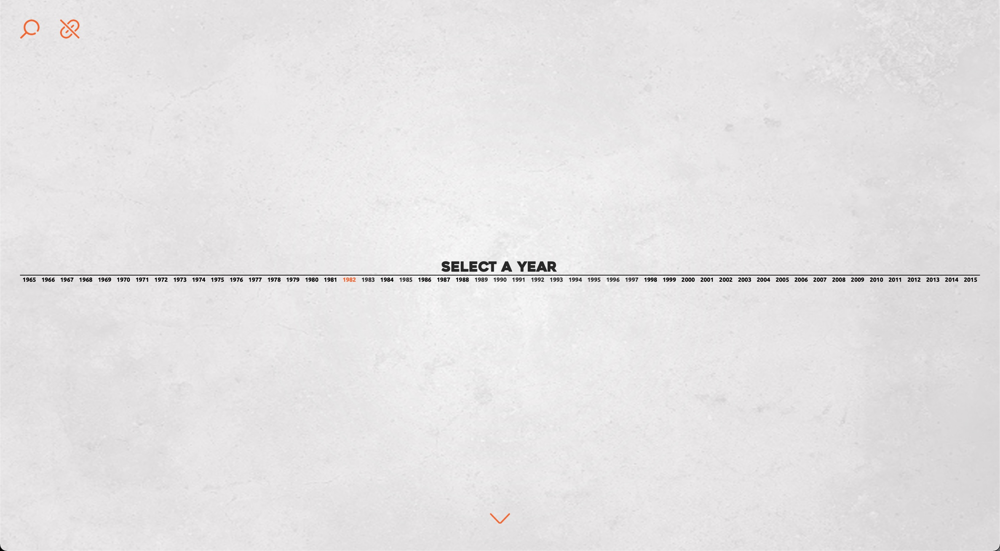

As the website is presented in a unique full-screen view, with a central timeline, the data points are organized around the latter, with the events taking place above the timeline and the songs below. The *y* position of the event points do not have any specific meaning. As there are a lot of events, it has been decided to spread them in the space, for readability and distinguishability.

As the user clicks on a year, one zoom in the timeline range specified by the given year and the data points appear. With the data being displayed, the user can hover over a point to access its summary and then click on it to open a half-window with the whole information. The timeline is then zoomed out to the original complete range in order to display an overview of all corresponding data points. The same process applies for the second part until the two half-windows are open. The latter display the complete information, which is the wikipedia summary for the events together with the corresponding wikipedia link and the lyrics for the songs together with a link to the *Youtube* video. This last part shows the words in the descriptions that helped link the two entities by highlighting them and adding the tag produced by the Named Entity Recognition (NER) algorithm.

| 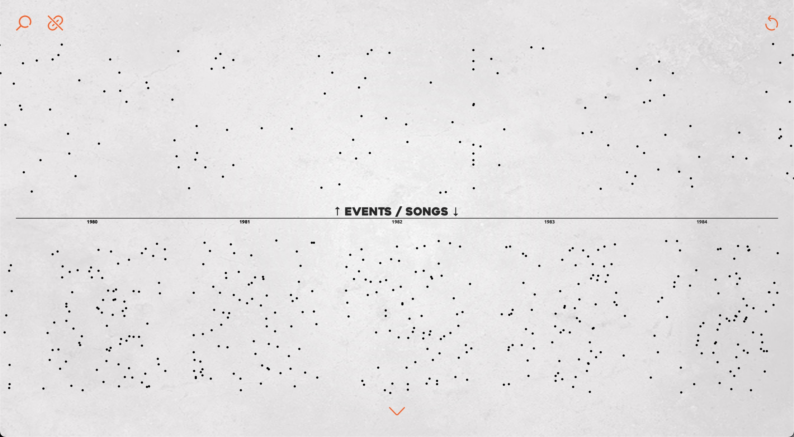 | 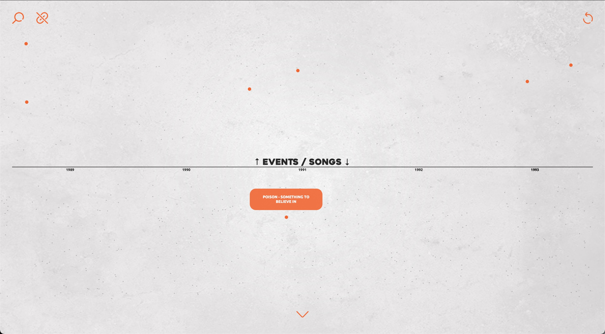 |
| ------------------------------------------------------------ | ------------------------------------------------------------ |
| 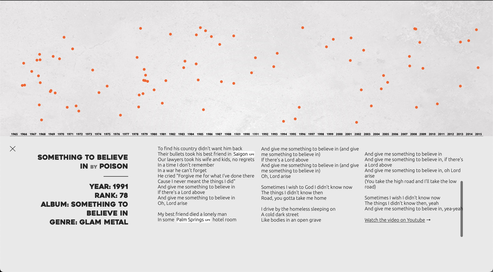 | 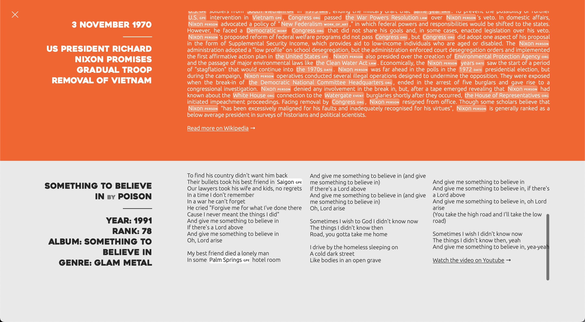 |

The website implements another tool as the search engine. It allows to filter songs or events given some attributes or constraints, such as for example, a genre or a word in the event’s description. The timeline visualization combined with the search engine offers the possibility to find the distribution of a given feature over the fifty years the dataset covers – e.g., the distribution of a word in the lyrics since 1965.

| 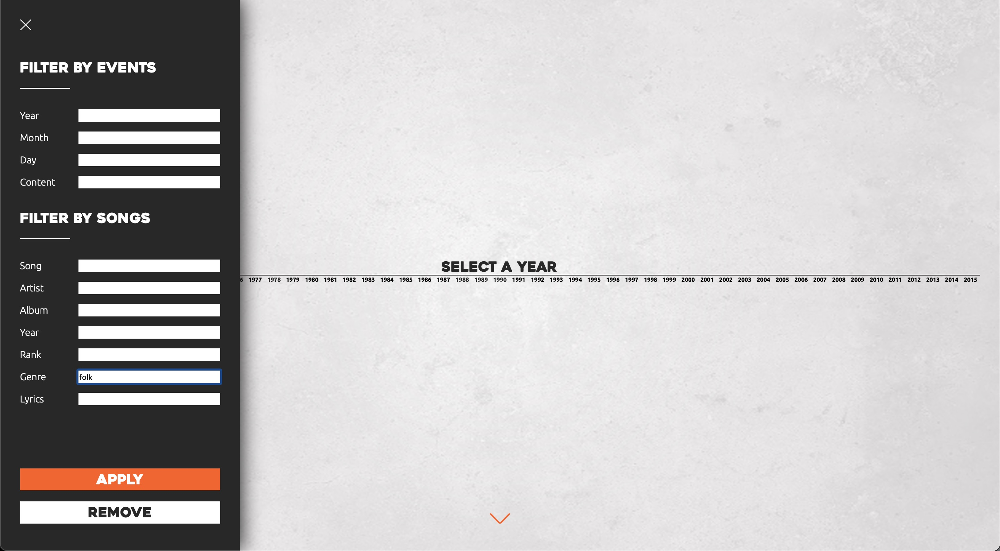 | 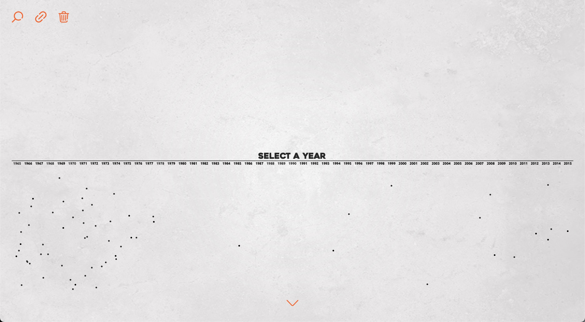 |
| ------------------------------------------------------------ | ------------------------------------------------------------ |
| 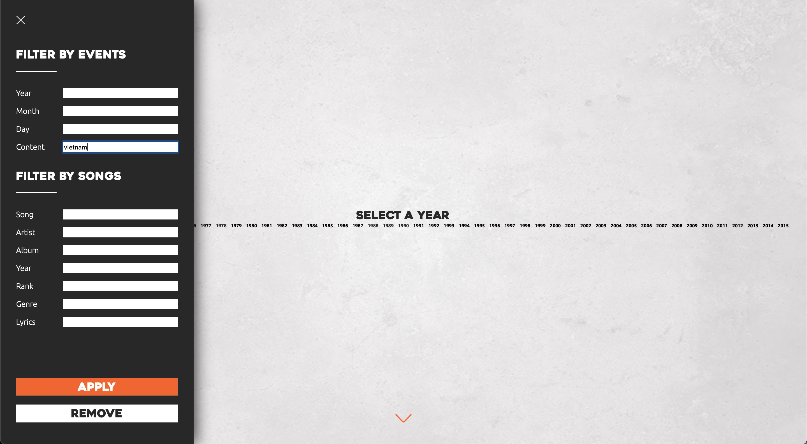 | 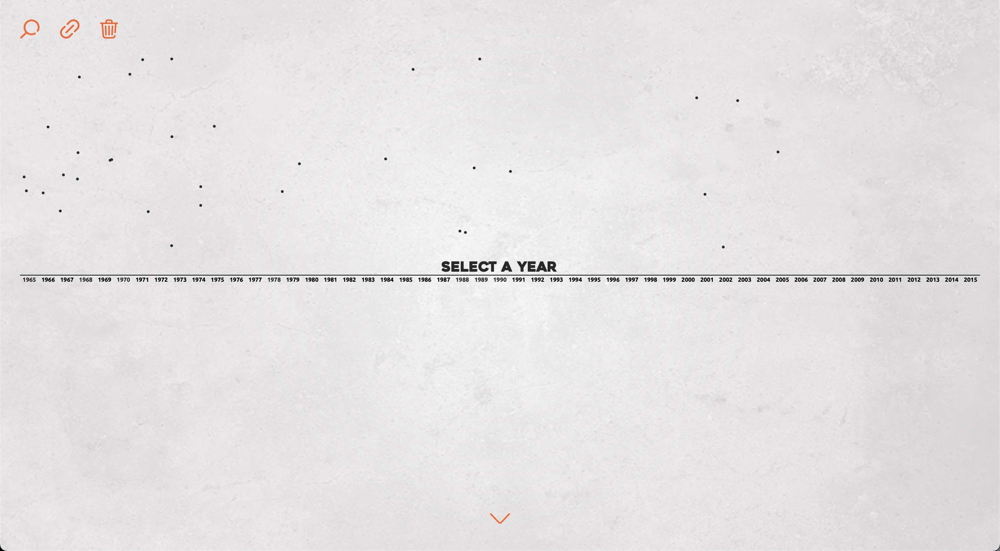 |

## Data analysis
Note that the graphs presented below appear more visible with the night theme enabled.

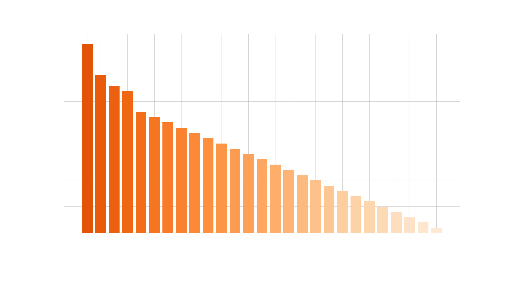

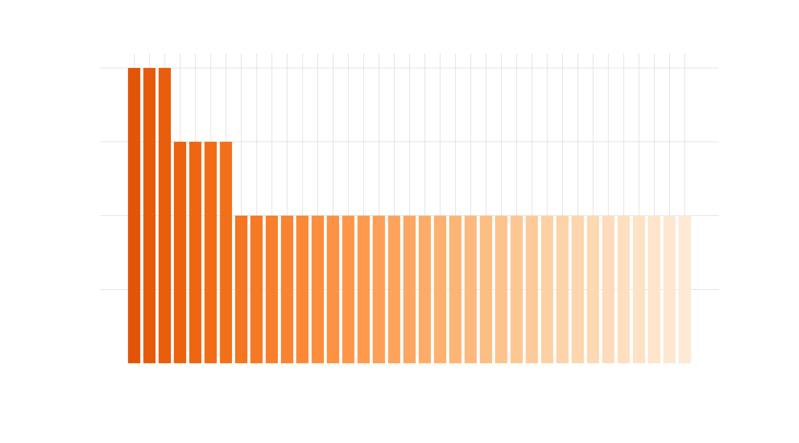

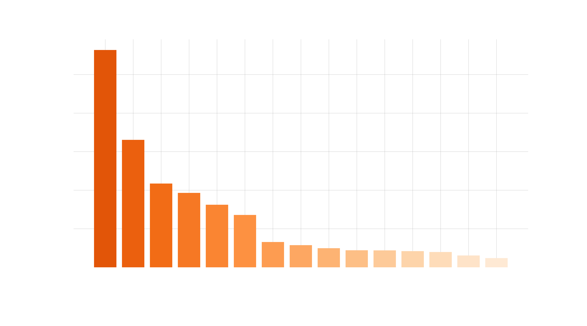

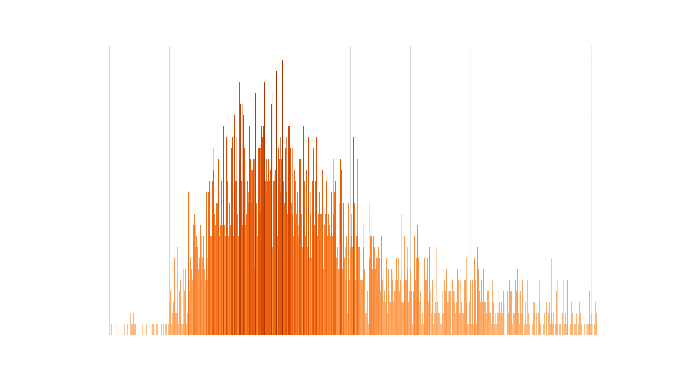

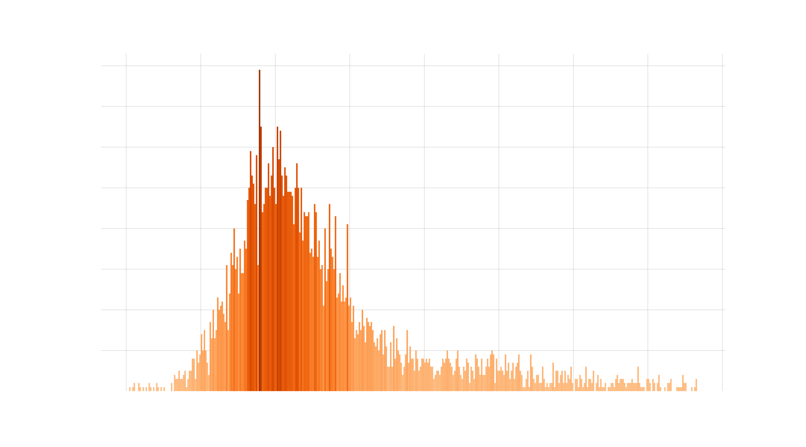

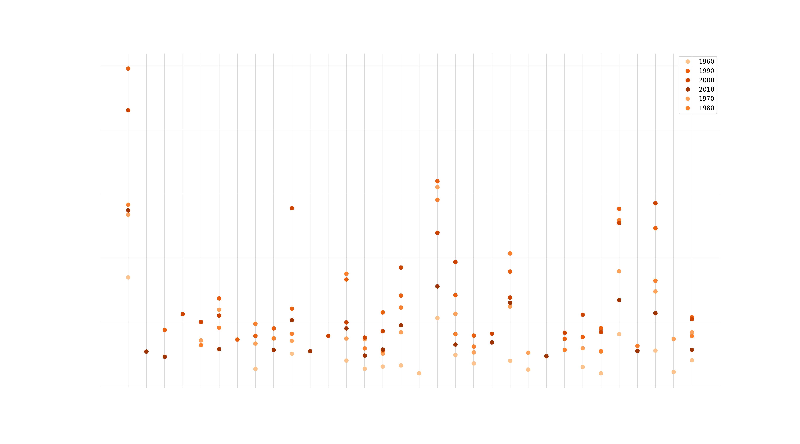

## Conclusion

The afore described data visualization website deals with a big amount of data. Nevertheless, by using a timeline as its core visualization element, it has been made easy to distribute the data points into the space and to navigate among such a lot of information. Moreover, the search engine has proven to be efficient to browse more efficiently in the dataset. Finally, many if not all cases have been dealt with in order to prevent the user to get lost.

However, as this project was implemented in a [*Data Visualization*](https://edu.epfl.ch/coursebook/en/data-visualization-COM-480) course, all the efforts have been put into the visualization itself, and just a little put in the efficicency. This results in some animation lacking smoothness, since the website has to handle a big dataset. Furthermore, as already mentionned, due to the focus on the data visualization part the NLP model is not accurate enough and prevents the user to obtain relevant matchings.

------

**IMPORTANT NOTE : For the moment, the website only works properly on Safari, some functionnalities such as zooming out of the timeline do not work on other browsers.*
